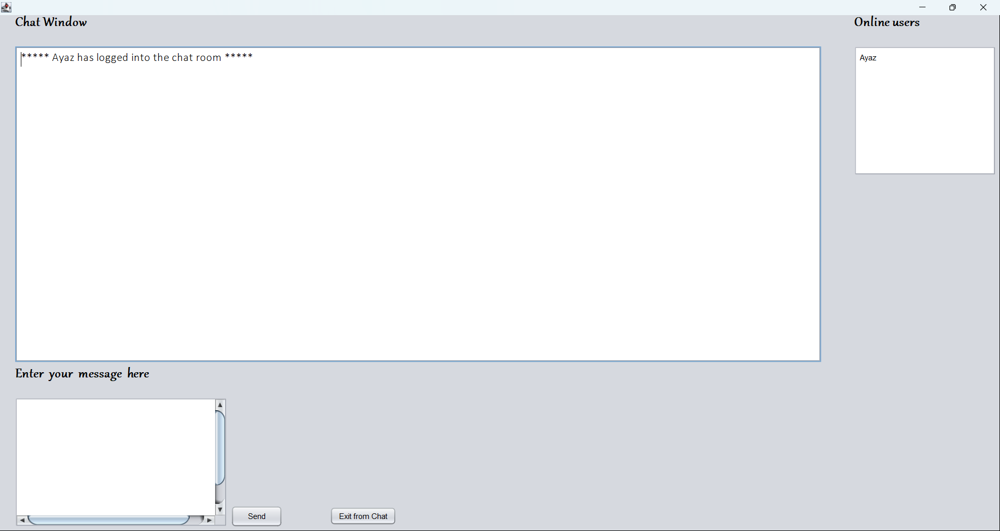

# 🧑‍💻 LAN Chat App using UDP Multicasting in Java

A lightweight desktop chat application built in **Java** using **UDP Multicasting**. It enables users connected to the **same Local Area Network (LAN)** to send and receive messages in real-time. Built with **NetBeans IDE**, this project demonstrates core Java **network programming** using the **User Datagram Protocol (UDP)**.

---

## 🛠 Features

- 💬 Real-time text messaging over LAN
- 📡 Uses UDP Multicast to broadcast messages to all clients
- 🧑‍🤝‍🧑 Supports multiple users chatting simultaneously
- ⚡ Lightweight, no server needed
- 🧰 Simple GUI built with Java Swing
- 🖥️ Desktop application (cross-platform)
- 📦 Easily runnable in NetBeans IDE

---

## 📷 Screenshot

---

## 🔧 Technologies Used

- Java SE
- UDP (DatagramSocket & MulticastSocket)
- Swing (Java GUI Toolkit)
- NetBeans IDE

---

## 🚀 Getting Started

### 📥 Clone the Repository

git clone https://github.com/mahamadayazmomin/lan-chat-app.git

---

## 🧰 Open with NetBeans

1. Open NetBeans IDE
2. Go to File → Open Project
3. Navigate to the cloned repository and open the project folder
4. Clean and Build the project
5. Run the ChatClient.java file (or appropriate main class)

🔁 Repeat this step on multiple computers connected to the same LAN to test chat functionality.

---

## 📡 How It Works

- Each client joins a Multicast Group (e.g., 230.0.0.0 on port 4446)
- When a message is sent, it is broadcast to all group members
- Each client listens to the same multicast address and displays the received messages in the GUI
- No central server is needed; the architecture is peer-to-peer

---

## ✅ Requirements

- Java 8 or above
- NetBeans IDE (any recent version)
- All clients must be connected to the same Local Network

---

## ⚠️ Limitations

- Only works within the same LAN
- Does not support file transfer or message encryption
- May not work if multicast is disabled on the router/network

---

## 📌 Future Improvements

- Add user authentication
- Implement message history
- Add file sharing capability
- Add emojis or formatting
- Use TCP for guaranteed delivery (optional variant)

---

## 📝 License

This open-source project is available under the [MIT License](LICENSE).

---

## 🙌 Acknowledgments

Inspired by the core concepts of Java Network Programming. Created as a simple educational project for learning UDP multicast in local networks.

---

## 💡 Author

[GitHub](https://github.com/mahamadayazmomin) | [LinkedIn](https://www.linkedin.com/in/mahamadayaz-momin)

